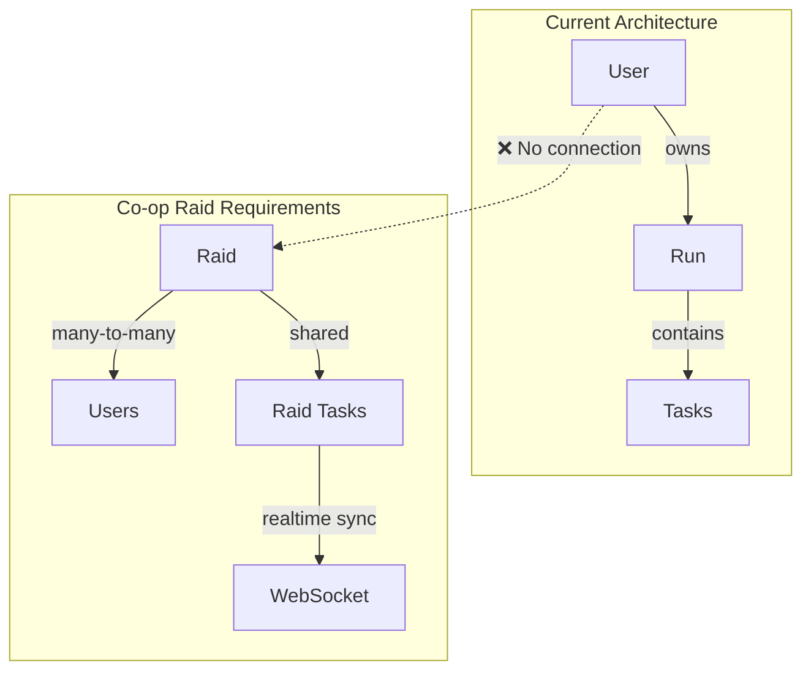
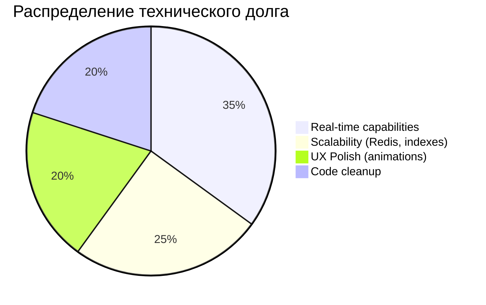

# 🔬 Deep Architecture Audit: Rogue-Day

> **Цель:** Подготовка архитектуры к взрывному росту фич без боли и переписывания

---

## 1. 🏗️ СТРЕСС-ТЕСТ АРХИТЕКТУРЫ: Co-op Raids

Представим, что завтра мы начинаем делать фичу **"Co-op Raids"** — несколько пользователей выполняют общую цель в реальном времени.

### 1.1 Текущие узкие места



| Компонент | Проблема | Критичность |
|-----------|----------|-------------|
| **User → Run** | 1:N связь не поддерживает shared ownership | 🔴 Critical |
| **Task.run_id** | Жёсткая привязка к Run, нельзя shared task | 🔴 Critical |
| **Zustand Store** | HTTP polling, нет real-time подписок | 🟡 Medium |
| **API Layer** | REST-only, нет WebSocket endpoints | 🟡 Medium |

### 1.2 Предлагаемые изменения: Backend

#### [NEW] models — Добавить Raid сущности

```python
# backend/app/models.py — Новые модели для Co-op Raids

class RaidStatus(str, enum.Enum):
    RECRUITING = "recruiting"
    ACTIVE = "active"
    COMPLETED = "completed"
    FAILED = "failed"

class RaidMemberRole(str, enum.Enum):
    LEADER = "leader"
    MEMBER = "member"


class Raid(Base):
    """
    Кооперативный рейд — общая цель для нескольких игроков.
    """
    __tablename__ = "raids"
    __table_args__ = (
        Index('ix_raids_status_created', 'status', 'created_at'),
    )
    
    id = Column(Integer, primary_key=True, index=True)
    
    # Raid metadata
    title = Column(String(255), nullable=False)
    description = Column(Text, nullable=True)
    max_members = Column(Integer, default=4)
    invite_code = Column(String(8), unique=True, index=True)  # Short join code
    
    # Goals
    target_xp = Column(Integer, nullable=False)
    target_tasks = Column(Integer, nullable=False)
    time_limit_hours = Column(Integer, default=24)
    
    # Progress (denormalized for performance)
    current_xp = Column(Integer, default=0)
    current_tasks = Column(Integer, default=0)
    
    # Status
    status = Column(SQLEnum(RaidStatus), default=RaidStatus.RECRUITING)
    
    # Timestamps
    created_at = Column(DateTime(timezone=True), server_default=func.now())
    started_at = Column(DateTime(timezone=True), nullable=True)
    ended_at = Column(DateTime(timezone=True), nullable=True)
    
    # Relationships
    members = relationship("RaidMember", back_populates="raid", cascade="all, delete-orphan")
    contributions = relationship("RaidContribution", back_populates="raid")


class RaidMember(Base):
    """
    Junction table: User <-> Raid (many-to-many with extra data).
    """
    __tablename__ = "raid_members"
    __table_args__ = (
        Index('ix_raid_members_user_raid', 'user_id', 'raid_id', unique=True),
    )
    
    id = Column(Integer, primary_key=True, index=True)
    raid_id = Column(Integer, ForeignKey("raids.id", ondelete="CASCADE"), nullable=False)
    user_id = Column(Integer, ForeignKey("users.id", ondelete="CASCADE"), nullable=False)
    
    role = Column(SQLEnum(RaidMemberRole), default=RaidMemberRole.MEMBER)
    
    # Individual contribution tracking
    xp_contributed = Column(Integer, default=0)
    tasks_contributed = Column(Integer, default=0)
    
    joined_at = Column(DateTime(timezone=True), server_default=func.now())
    
    # Relationships
    raid = relationship("Raid", back_populates="members")
    user = relationship("User")


class RaidContribution(Base):
    """
    Log of individual contributions to raid (for replay/audit).
    """
    __tablename__ = "raid_contributions"
    __table_args__ = (
        Index('ix_raid_contributions_raid_created', 'raid_id', 'created_at'),
    )
    
    id = Column(Integer, primary_key=True, index=True)
    raid_id = Column(Integer, ForeignKey("raids.id", ondelete="CASCADE"), nullable=False)
    user_id = Column(Integer, ForeignKey("users.id", ondelete="CASCADE"), nullable=False)
    task_id = Column(Integer, ForeignKey("tasks.id", ondelete="SET NULL"), nullable=True)
    
    xp_amount = Column(Integer, nullable=False)
    contribution_type = Column(String(50), nullable=False)  # "task_complete", "bonus", etc.
    
    created_at = Column(DateTime(timezone=True), server_default=func.now())
    
    raid = relationship("Raid", back_populates="contributions")
```

#### [NEW] services — CoopRaidService

```python
# backend/app/services/raid_service.py

from typing import Optional
from sqlalchemy.ext.asyncio import AsyncSession
from sqlalchemy import select, and_
from sqlalchemy.orm import selectinload
import secrets

from app.models import Raid, RaidMember, RaidContribution, User, Task, RaidStatus, RaidMemberRole


class RaidService:
    """
    Domain service for Co-op Raid operations.
    All business logic lives here, NOT in API handlers.
    """
    
    def __init__(self, db: AsyncSession):
        self.db = db
    
    async def create_raid(
        self,
        leader: User,
        title: str,
        target_xp: int,
        target_tasks: int,
        time_limit_hours: int = 24,
        max_members: int = 4,
    ) -> Raid:
        """Create a new raid with the user as leader."""
        invite_code = secrets.token_urlsafe(6)[:8].upper()
        
        raid = Raid(
            title=title,
            target_xp=target_xp,
            target_tasks=target_tasks,
            time_limit_hours=time_limit_hours,
            max_members=max_members,
            invite_code=invite_code,
        )
        self.db.add(raid)
        await self.db.flush()
        
        # Add leader as first member
        leader_member = RaidMember(
            raid_id=raid.id,
            user_id=leader.id,
            role=RaidMemberRole.LEADER,
        )
        self.db.add(leader_member)
        await self.db.flush()
        
        return raid
    
    async def join_raid(self, user: User, invite_code: str) -> RaidMember | None:
        """Join a raid by invite code."""
        raid = await self._get_raid_by_code(invite_code)
        if not raid or raid.status != RaidStatus.RECRUITING:
            return None
        
        # Check member limit
        member_count = len(raid.members)
        if member_count >= raid.max_members:
            return None
        
        # Check if already member
        existing = await self._get_membership(user.id, raid.id)
        if existing:
            return existing
        
        member = RaidMember(
            raid_id=raid.id,
            user_id=user.id,
            role=RaidMemberRole.MEMBER,
        )
        self.db.add(member)
        await self.db.flush()
        
        return member
    
    async def contribute_task(
        self,
        user: User,
        raid: Raid,
        task: Task,
    ) -> RaidContribution:
        """
        Record a task contribution to the raid.
        Called when a raid member completes a task.
        """
        contribution = RaidContribution(
            raid_id=raid.id,
            user_id=user.id,
            task_id=task.id,
            xp_amount=task.xp_earned,
            contribution_type="task_complete",
        )
        self.db.add(contribution)
        
        # Update denormalized counters
        raid.current_xp += task.xp_earned
        raid.current_tasks += 1
        
        # Update member stats
        member = await self._get_membership(user.id, raid.id)
        if member:
            member.xp_contributed += task.xp_earned
            member.tasks_contributed += 1
        
        # Check if raid is complete
        if raid.current_xp >= raid.target_xp and raid.current_tasks >= raid.target_tasks:
            raid.status = RaidStatus.COMPLETED
            raid.ended_at = datetime.utcnow()
        
        await self.db.flush()
        return contribution
    
    async def get_user_active_raids(self, user: User) -> list[Raid]:
        """Get all active raids user is participating in."""
        result = await self.db.execute(
            select(Raid)
            .join(RaidMember)
            .where(
                and_(
                    RaidMember.user_id == user.id,
                    Raid.status.in_([RaidStatus.RECRUITING, RaidStatus.ACTIVE])
                )
            )
            .options(selectinload(Raid.members))
        )
        return result.scalars().all()
    
    async def _get_raid_by_code(self, code: str) -> Raid | None:
        result = await self.db.execute(
            select(Raid)
            .where(Raid.invite_code == code.upper())
            .options(selectinload(Raid.members))
        )
        return result.scalar_one_or_none()
    
    async def _get_membership(self, user_id: int, raid_id: int) -> RaidMember | None:
        result = await self.db.execute(
            select(RaidMember)
            .where(and_(
                RaidMember.user_id == user_id,
                RaidMember.raid_id == raid_id
            ))
        )
        return result.scalar_one_or_none()
```

### 1.3 Предлагаемые изменения: Frontend (Real-time)

> [!IMPORTANT]
> Для Co-op нужен **WebSocket** или **Server-Sent Events** для real-time обновлений.

#### Рекомендация: Zustand + SSE (проще, чем WebSocket)

```typescript
// app/src/store/useRaidStore.ts

import { create } from 'zustand';

interface RaidMember {
    userId: number;
    username: string;
    xpContributed: number;
    tasksContributed: number;
    isOnline: boolean;
}

interface RaidState {
    raid: {
        id: number;
        title: string;
        targetXP: number;
        targetTasks: number;
        currentXP: number;
        currentTasks: number;
        members: RaidMember[];
    } | null;
    
    // SSE connection
    eventSource: EventSource | null;
    isConnected: boolean;
    
    // Actions
    connectToRaid: (raidId: number) => void;
    disconnect: () => void;
    
    // Internal: called by SSE events
    _handleContribution: (data: { userId: number; xp: number }) => void;
    _handleMemberJoin: (member: RaidMember) => void;
    _handleRaidComplete: () => void;
}

export const useRaidStore = create<RaidState>((set, get) => ({
    raid: null,
    eventSource: null,
    isConnected: false,
    
    connectToRaid: (raidId) => {
        // Close existing connection
        get().disconnect();
        
        const es = new EventSource(
            `${API_BASE}/api/v1/raids/${raidId}/stream`
        );
        
        es.onopen = () => {
            set({ isConnected: true });
        };
        
        es.addEventListener('contribution', (e) => {
            const data = JSON.parse(e.data);
            get()._handleContribution(data);
        });
        
        es.addEventListener('member_join', (e) => {
            const member = JSON.parse(e.data);
            get()._handleMemberJoin(member);
        });
        
        es.addEventListener('raid_complete', () => {
            get()._handleRaidComplete();
        });
        
        es.onerror = () => {
            set({ isConnected: false });
            // Reconnect after delay
            setTimeout(() => get().connectToRaid(raidId), 5000);
        };
        
        set({ eventSource: es });
    },
    
    disconnect: () => {
        const { eventSource } = get();
        if (eventSource) {
            eventSource.close();
            set({ eventSource: null, isConnected: false });
        }
    },
    
    _handleContribution: ({ userId, xp }) => {
        set((state) => {
            if (!state.raid) return state;
            
            return {
                raid: {
                    ...state.raid,
                    currentXP: state.raid.currentXP + xp,
                    currentTasks: state.raid.currentTasks + 1,
                    members: state.raid.members.map(m =>
                        m.userId === userId
                            ? { ...m, xpContributed: m.xpContributed + xp, tasksContributed: m.tasksContributed + 1 }
                            : m
                    ),
                },
            };
        });
    },
    
    _handleMemberJoin: (member) => {
        set((state) => {
            if (!state.raid) return state;
            return {
                raid: {
                    ...state.raid,
                    members: [...state.raid.members, member],
                },
            };
        });
    },
    
    _handleRaidComplete: () => {
        set((state) => {
            if (!state.raid) return state;
            // Trigger celebration modal, etc.
            return state;
        });
    },
}));
```

### 1.4 Миграционный путь

1. **Phase 1:** Добавить модели `Raid`, `RaidMember`, `RaidContribution` (неблокирующие изменения)
2. **Phase 2:** Реализовать `RaidService` с базовой логикой
3. **Phase 3:** Добавить SSE endpoint `/raids/{id}/stream`
4. **Phase 4:** Frontend store + UI компоненты

---

## 2. ✨ НЕОЧЕВИДНЫЕ УЛУЧШЕНИЯ (Next-Level Polish)

### 2.1 UX/Анимации: Добавление "сока"

#### XP Gain Animation (Particle Burst)

```tsx
// app/src/components/run/XPGainEffect.tsx

import { motion, AnimatePresence } from 'framer-motion';
import { useEffect, useState } from 'react';

interface XPGainEffectProps {
    amount: number;
    trigger: number; // Change this to trigger animation
}

export function XPGainEffect({ amount, trigger }: XPGainEffectProps) {
    const [particles, setParticles] = useState<number[]>([]);
    
    useEffect(() => {
        if (trigger > 0) {
            // Generate 8-12 particles
            const count = 8 + Math.floor(Math.random() * 5);
            setParticles(Array.from({ length: count }, (_, i) => i));
            
            // Clear after animation
            const timer = setTimeout(() => setParticles([]), 1500);
            return () => clearTimeout(timer);
        }
    }, [trigger]);
    
    return (
        <div className="relative">
            <AnimatePresence>
                {/* Main XP number */}
                {trigger > 0 && (
                    <motion.div
                        key={trigger}
                        initial={{ opacity: 0, scale: 0.5, y: 0 }}
                        animate={{ opacity: 1, scale: 1, y: -20 }}
                        exit={{ opacity: 0, y: -40 }}
                        transition={{ 
                            duration: 0.6,
                            type: "spring",
                            stiffness: 200,
                        }}
                        className="absolute -top-8 left-1/2 -translate-x-1/2 
                                   text-lg font-bold font-mono whitespace-nowrap
                                   text-[var(--accent-xp)] drop-shadow-lg"
                    >
                        +{amount} XP ✨
                    </motion.div>
                )}
                
                {/* Particle burst */}
                {particles.map((i) => (
                    <motion.div
                        key={`particle-${trigger}-${i}`}
                        className="absolute w-2 h-2 rounded-full bg-[var(--accent-xp)]"
                        initial={{
                            opacity: 1,
                            scale: 1,
                            x: 0,
                            y: 0,
                        }}
                        animate={{
                            opacity: 0,
                            scale: 0,
                            x: (Math.random() - 0.5) * 100,
                            y: (Math.random() - 0.5) * 100 - 30,
                        }}
                        transition={{
                            duration: 0.8 + Math.random() * 0.4,
                            ease: "easeOut",
                        }}
                    />
                ))}
            </AnimatePresence>
        </div>
    );
}
```

#### Screen Shake on Task Fail

```tsx
// app/src/components/run/ScreenShake.tsx

import { motion, useAnimation } from 'framer-motion';
import { useEffect, ReactNode } from 'react';

interface ScreenShakeProps {
    children: ReactNode;
    trigger: number; // Increment to trigger shake
    intensity?: 'light' | 'medium' | 'heavy';
}

const shakeVariants = {
    light: { x: [-2, 2, -2, 2, 0], rotate: [-0.5, 0.5, -0.5, 0.5, 0] },
    medium: { x: [-5, 5, -5, 5, -3, 3, 0], rotate: [-1, 1, -1, 1, 0] },
    heavy: { x: [-10, 10, -8, 8, -5, 5, -2, 2, 0], rotate: [-2, 2, -1.5, 1.5, -1, 1, 0] },
};

export function ScreenShake({ children, trigger, intensity = 'medium' }: ScreenShakeProps) {
    const controls = useAnimation();
    
    useEffect(() => {
        if (trigger > 0) {
            controls.start({
                ...shakeVariants[intensity],
                transition: { duration: intensity === 'heavy' ? 0.5 : 0.3 },
            });
        }
    }, [trigger, intensity, controls]);
    
    return (
        <motion.div animate={controls}>
            {children}
        </motion.div>
    );
}

// Usage in ServerTaskSlot.tsx:
// const [failShake, setFailShake] = useState(0);
// const handleFail = () => { setFailShake(s => s + 1); ... }
// <ScreenShake trigger={failShake} intensity="medium">...</ScreenShake>
```

#### Energy Pulse on Low Energy

```tsx
// In EnergyMeter.tsx — add pulsing when energy < 20%

const isLowEnergy = current / max < 0.2;

<motion.div
    className="energy-bar"
    animate={isLowEnergy ? {
        boxShadow: [
            '0 0 0 rgba(255, 100, 100, 0)',
            '0 0 15px rgba(255, 100, 100, 0.6)',
            '0 0 0 rgba(255, 100, 100, 0)'
        ]
    } : {}}
    transition={{ 
        duration: 1.5, 
        repeat: Infinity,
        ease: "easeInOut" 
    }}
>
    {/* ... */}
</motion.div>
```

### 2.2 Потенциальные "бомбы замедленного действия"

| Проблема | Файл | Риск | Решение |
|----------|------|------|---------|
| `totalFocusMinutes` пересчитывается на каждый рендер | [RunPage.tsx:24-26](file:///c:/Users/U/Desktop/rouge_like_todo/app/src/pages/RunPage.tsx#L24-L26) | 🟡 Medium | Вынести в `useMemo` |
| `calculateRemainingSeconds` вызывается на каждый рендер | [ServerTaskSlot.tsx:66-68](file:///c:/Users/U/Desktop/rouge_like_todo/app/src/components/run/ServerTaskSlot.tsx#L66-L68) | 🟢 Low | Уже в `useMemo` ✓ |
| Нет debounce на `refreshRun()` | [useServerRunStore.ts:148-155](file:///c:/Users/U/Desktop/rouge_like_todo/app/src/store/useServerRunStore.ts#L148-L155) | 🟡 Medium | Добавить throttle |

**Рефакторинг RunPage totalFocusMinutes:**

```diff
// RunPage.tsx
+ import { useMemo } from 'react';

- // Calculate total focus minutes from completed tasks
- const totalFocusMinutes = tasks
-     .filter(t => t.status === 'completed')
-     .reduce((sum, t) => sum + (t.duration || 0), 0);

+ // Memoize to avoid recalculation on every render
+ const totalFocusMinutes = useMemo(() => 
+     tasks
+         .filter(t => t.status === 'completed')
+         .reduce((sum, t) => sum + (t.duration || 0), 0),
+     [tasks]
+ );
```

### 2.3 "Умные" фичи с минимальными усилиями

1. **Автостарт таймера при переходе к задаче**  
   Уже реализовано в `ServerTaskSlot.tsx:71` через `shouldAutoStart` ✓

2. **Умные подсказки задач на утро**
   ```typescript
   // Backend: Добавить endpoint
   // GET /api/v1/suggestions
   // Анализ: самые частые задачи по дню недели, время выполнения
   // Frontend: Показывать в пустом состоянии RunPage
   ```

3. **Streak-aware notifications**  
   Если пользователь обычно начинает ран до 10:00, но сегодня не начал — push в Telegram

---

## 3. 📈 SCALABILITY & DEVOPS

### 3.1 База данных: Индексы

Текущие индексы уже неплохие, но для 100k+ пользователей рекомендую:

```sql
-- Добавить составной индекс для частых запросов
-- "Найти активный ран пользователя за сегодня"
CREATE INDEX CONCURRENTLY ix_runs_user_date_status 
ON runs (user_id, run_date, status);

-- Индекс для streak-логики (поиск последнего рана)
CREATE INDEX CONCURRENTLY ix_runs_user_started_desc 
ON runs (user_id, started_at DESC);

-- Для extractions (история пользователя)
CREATE INDEX CONCURRENTLY ix_extractions_user_created 
ON extractions (user_id, created_at DESC);
```

### 3.2 Партиционирование

> [!TIP]
> Рассмотрите партиционирование по дате для `tasks` и `raid_contributions` когда достигнете 1M+ записей.

```sql
-- Пример: партиционирование tasks по месяцам
CREATE TABLE tasks_partitioned (
    LIKE tasks INCLUDING ALL
) PARTITION BY RANGE (created_at);

CREATE TABLE tasks_y2024m01 PARTITION OF tasks_partitioned
    FOR VALUES FROM ('2024-01-01') TO ('2024-02-01');
```

### 3.3 Redis: Схема ключей

| Use Case | Key Pattern | TTL | Value |
|----------|-------------|-----|-------|
| User session | `session:{telegram_id}` | 24h | User JSON |
| Active run cache | `run:active:{user_id}` | 1h | Run JSON |
| Rate limiting | `ratelimit:{user_id}:{endpoint}` | 1m | Counter (int) |
| Leaderboard daily | `leaderboard:daily:{date}` | 24h | Sorted Set |
| Leaderboard weekly | `leaderboard:weekly:{week}` | 7d | Sorted Set |
| Raid realtime state | `raid:{raid_id}:state` | 1h | Raid JSON |
| Raid pubsub | `raid:{raid_id}:events` | — | PubSub channel |

```python
# Пример: Redis cache decorator для FastAPI
from functools import wraps
import redis.asyncio as redis
import json

redis_client = redis.Redis(host='localhost', port=6379, decode_responses=True)

def cache_run(ttl_seconds: int = 3600):
    def decorator(func):
        @wraps(func)
        async def wrapper(user_id: int, *args, **kwargs):
            cache_key = f"run:active:{user_id}"
            
            # Try cache first
            cached = await redis_client.get(cache_key)
            if cached:
                return json.loads(cached)
            
            # Cache miss - call actual function
            result = await func(user_id, *args, **kwargs)
            
            if result:
                await redis_client.setex(
                    cache_key, 
                    ttl_seconds, 
                    json.dumps(result, default=str)
                )
            
            return result
        return wrapper
    return decorator
```

### 3.4 Мониторинг: Ключевые метрики

| Метрика | Порог Alert | Почему важно |
|---------|-------------|--------------|
| **API P95 Latency** | > 500ms | UX деградация, особенно на mobile |
| **5xx Error Rate** | > 1% | Системная нестабильность |
| **DB Connection Pool Saturation** | > 80% | Предвестник отказов |

**Дополнительно для Railway/Vercel:**
- Memory usage (Railway: container limits)
- Cold start duration (Vercel: serverless functions)
- Active WebSocket connections (если добавите Co-op)

---

## 4. 🧹 ФИНАЛЬНАЯ ЧИСТКА

### 4.1 Code Smells

#### Избыточный query parameter

```python
# api.ts:44-48 — telegram_id добавляется как query param
# Это legacy, т.к. теперь используется X-Telegram-Init-Data header

# Можно удалить:
- url.searchParams.set('telegram_id', telegramId.toString());
```

#### Magic числа в streak логике

```python
# runs.py:141-158 — логика streak разбросана в endpoint

# Лучше вынести в domain service:
# backend/app/services/streak_service.py

class StreakService:
    @staticmethod
    def calculate_new_streak(last_run_at: datetime | None, current_streak: int) -> int:
        """Calculate streak after extraction."""
        if not last_run_at:
            return 1
        
        today = date.today()
        last_run_date = last_run_at.date()
        yesterday = today - timedelta(days=1)
        
        if last_run_date >= yesterday:
            return current_streak + 1
        return 1  # Reset
```

#### Дублирование RunResponse сериализации

```diff
# runs.py — Повторяющийся код сериализации в нескольких endpoints

+ # Вынести в helper или использовать model_validate:
+ def serialize_run(run: Run, include_tasks: bool = True) -> RunResponse:
+     return RunResponse(
+         id=run.id,
+         user_id=run.user_id,
+         run_date=run.run_date,
+         daily_xp=run.daily_xp,
+         focus_energy=run.focus_energy,
+         max_energy=run.max_energy,
+         total_focus_minutes=run.total_focus_minutes,
+         status=run.status,
+         tasks=[TaskResponse.model_validate(t) for t in run.tasks] if include_tasks else [],
+         started_at=run.started_at,
+         extracted_at=run.extracted_at,
+     )
```

### 4.2 Рекомендуемые рефакторинги (приоритет)

| Приоритет | Изменение | Файл | Effort |
|-----------|-----------|------|--------|
| 🔴 P0 | Удалить telegram_id query param | [api.ts](file:///c:/Users/U/Desktop/rouge_like_todo/app/src/lib/api.ts#L44-L48) | 5 min |
| 🟡 P1 | Вынести `totalFocusMinutes` в useMemo | [RunPage.tsx](file:///c:/Users/U/Desktop/rouge_like_todo/app/src/pages/RunPage.tsx#L24-L26) | 5 min |
| 🟡 P1 | Добавить throttle на refreshRun | [useServerRunStore.ts](file:///c:/Users/U/Desktop/rouge_like_todo/app/src/store/useServerRunStore.ts#L148-L155) | 15 min |
| 🟢 P2 | Вынести streak логику в StreakService | [runs.py](file:///c:/Users/U/Desktop/rouge_like_todo/backend/app/api/endpoints/runs.py#L141-L158) | 30 min |
| 🟢 P2 | Создать serialize_run helper | [runs.py](file:///c:/Users/U/Desktop/rouge_like_todo/backend/app/api/endpoints/runs.py) | 20 min |

---

## Резюме



### Рекомендуемый порядок действий:

1. **Сейчас (Quick Wins):** P0 + P1 рефакторинги (< 30 min)
2. **Следующий спринт:** Добавить превентивные индексы в БД
3. **Перед Co-op Raids:** Реализовать Redis + SSE инфраструктуру
4. **Параллельно:** Добавлять "сок" (анимации) по мере работы над UI
