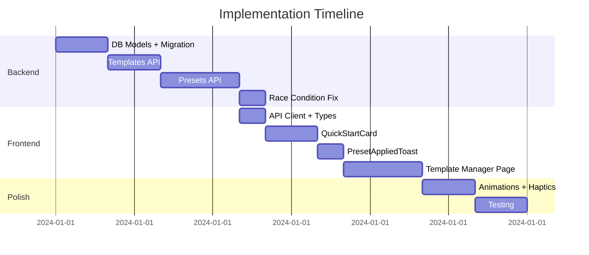

# Task Templates System — Implementation Plan

> **User Pain Point:** «Каждый день добавлять одни и те же задачи вручную — это боль»

---

## User Review Required

> [!IMPORTANT]
> **Выбор UX-флоу для создания шаблонов:**
> 1. **Вариант A:** Кнопка "Сохранить как шаблон" на каждой задаче в RunPage
> 2. **Вариант B:** Отдельная страница /templates с ручным созданием
> 3. **Вариант C:** Оба варианта (рекомендую)
>
> Какой подход предпочтительнее?

> [!WARNING]
> **Решение по энергии при применении пресета:**
> Если у пользователя недостаточно энергии для всех задач из пресета, варианты:
> - **A:** Отклонить весь пресет с ошибкой
> - **B:** Добавить только те задачи, на которые хватает энергии (с предупреждением)
> - **C:** Добавить все задачи как PENDING, но блокировать старт T2/T3 без энергии *(текущее поведение)*
>
> Рекомендую **вариант C** — это соответствует текущей механике.

---

## 1. 🔥 Архитектурные риски (Audit Findings)

| Приоритет | Риск | Файл | Описание | Решение |
|-----------|------|------|----------|---------|
| 🔴 Critical | Race Condition | [runs.py:56-61](file:///c:/Users/U/Desktop/rouge_like_todo/backend/app/api/endpoints/runs.py#L56-L61) | Два параллельных запроса `startNewRun` могут создать 2 рана (check-then-insert без блокировки) | Добавить `SELECT ... FOR UPDATE` или unique constraint на `(user_id, status='active')` |
| 🔴 Critical | Extraction with ACTIVE tasks | [runs.py:116-127](file:///c:/Users/U/Desktop/rouge_like_todo/backend/app/api/endpoints/runs.py#L116-L127) | Если задача в статусе ACTIVE при экстракции, она не учитывается как completed/failed | Авто-fail или блокировать экстракцию |
| 🟠 Important | No throttle on refreshRun | [useServerRunStore.ts:148](file:///c:/Users/U/Desktop/rouge_like_todo/app/src/store/useServerRunStore.ts#L148) | Каждое действие вызывает полный refresh рана — при плохом интернете может быть много запросов | Добавить `lodash.throttle` (300ms) |
| 🟡 Желательно | telegram_id query param | [api.ts:44-48](file:///c:/Users/U/Desktop/rouge_like_todo/app/src/lib/api.ts#L44-L48) | Legacy code: telegram_id отправляется дважды (header + query) | Удалить query param |
| 🟢 OK | Timer cleanup | [useTimer.ts:46-52](file:///c:/Users/U/Desktop/rouge_like_todo/app/src/hooks/useTimer.ts#L46-L52) | Правильный cleanup через return в useEffect ✓ | — |
| 🟢 OK | Double-click protection | [ServerTaskSlot.tsx:84-86](file:///c:/Users/U/Desktop/rouge_like_todo/app/src/components/run/ServerTaskSlot.tsx#L84-L86) | `isProcessing` state блокирует повторные клики ✓ | — |
| 🟢 OK | DB indexes | [models.py:57-60](file:///c:/Users/U/Desktop/rouge_like_todo/backend/app/models.py#L57-L60) | Составные индексы на `(user_id, status)` и `(user_id, run_date)` уже есть ✓ | — |

---

## 2. Proposed Changes — Task Templates System

### 2.1 Database Schema

---

#### [NEW] models.py — TaskTemplate, Preset, PresetTemplate

```python
# backend/app/models.py — ADD после class Extraction

class TaskTemplate(Base):
    """
    Reusable task template — user's saved task configuration.
    """
    __tablename__ = "task_templates"
    __table_args__ = (
        Index('ix_task_templates_user', 'user_id'),
    )
    
    id = Column(Integer, primary_key=True, index=True)
    user_id = Column(Integer, ForeignKey("users.id", ondelete="CASCADE"), nullable=False)
    
    # Template data (mirrors Task fields)
    title = Column(String(255), nullable=False)
    tier = Column(Integer, nullable=False)  # 1, 2, 3
    duration = Column(Integer, nullable=False)  # minutes
    use_timer = Column(Boolean, default=False)
    category = Column(String(50), nullable=True)  # "work", "health", "study", etc.
    
    # Meta
    source = Column(String(20), default="manual")  # "manual" or "from_task"
    times_used = Column(Integer, default=0)  # Usage counter for analytics
    
    # Timestamps
    created_at = Column(DateTime(timezone=True), server_default=func.now())
    updated_at = Column(DateTime(timezone=True), onupdate=func.now())
    
    # Relationships
    user = relationship("User")
    preset_links = relationship("PresetTemplate", back_populates="template", cascade="all, delete-orphan")


class Preset(Base):
    """
    Named collection of task templates for quick daily setup.
    """
    __tablename__ = "presets"
    __table_args__ = (
        Index('ix_presets_user', 'user_id'),
    )
    
    id = Column(Integer, primary_key=True, index=True)
    user_id = Column(Integer, ForeignKey("users.id", ondelete="CASCADE"), nullable=False)
    
    name = Column(String(100), nullable=False)  # "Продуктивное утро"
    emoji = Column(String(10), nullable=True)  # "🌅"
    is_favorite = Column(Boolean, default=False)  # Show first in list
    
    # Timestamps
    created_at = Column(DateTime(timezone=True), server_default=func.now())
    updated_at = Column(DateTime(timezone=True), onupdate=func.now())
    
    # Relationships
    user = relationship("User")
    template_links = relationship("PresetTemplate", back_populates="preset", cascade="all, delete-orphan", order_by="PresetTemplate.order")


class PresetTemplate(Base):
    """
    Junction table: Preset <-> TaskTemplate (many-to-many with order).
    """
    __tablename__ = "preset_templates"
    __table_args__ = (
        Index('ix_preset_templates_preset', 'preset_id'),
    )
    
    id = Column(Integer, primary_key=True, index=True)
    preset_id = Column(Integer, ForeignKey("presets.id", ondelete="CASCADE"), nullable=False)
    template_id = Column(Integer, ForeignKey("task_templates.id", ondelete="CASCADE"), nullable=False)
    
    order = Column(Integer, default=0)  # Order within preset
    
    # Relationships
    preset = relationship("Preset", back_populates="template_links")
    template = relationship("TaskTemplate", back_populates="preset_links")
```

---

#### Alembic Migration

```python
# backend/alembic/versions/xxxx_add_templates_and_presets.py

"""Add task templates and presets

Revision ID: xxxx
"""
from alembic import op
import sqlalchemy as sa

def upgrade():
    # Task Templates
    op.create_table(
        'task_templates',
        sa.Column('id', sa.Integer(), primary_key=True),
        sa.Column('user_id', sa.Integer(), sa.ForeignKey('users.id', ondelete='CASCADE'), nullable=False),
        sa.Column('title', sa.String(255), nullable=False),
        sa.Column('tier', sa.Integer(), nullable=False),
        sa.Column('duration', sa.Integer(), nullable=False),
        sa.Column('use_timer', sa.Boolean(), default=False),
        sa.Column('category', sa.String(50), nullable=True),
        sa.Column('source', sa.String(20), default='manual'),
        sa.Column('times_used', sa.Integer(), default=0),
        sa.Column('created_at', sa.DateTime(timezone=True), server_default=sa.func.now()),
        sa.Column('updated_at', sa.DateTime(timezone=True), onupdate=sa.func.now()),
    )
    op.create_index('ix_task_templates_user', 'task_templates', ['user_id'])
    
    # Presets
    op.create_table(
        'presets',
        sa.Column('id', sa.Integer(), primary_key=True),
        sa.Column('user_id', sa.Integer(), sa.ForeignKey('users.id', ondelete='CASCADE'), nullable=False),
        sa.Column('name', sa.String(100), nullable=False),
        sa.Column('emoji', sa.String(10), nullable=True),
        sa.Column('is_favorite', sa.Boolean(), default=False),
        sa.Column('created_at', sa.DateTime(timezone=True), server_default=sa.func.now()),
        sa.Column('updated_at', sa.DateTime(timezone=True), onupdate=sa.func.now()),
    )
    op.create_index('ix_presets_user', 'presets', ['user_id'])
    
    # Junction table
    op.create_table(
        'preset_templates',
        sa.Column('id', sa.Integer(), primary_key=True),
        sa.Column('preset_id', sa.Integer(), sa.ForeignKey('presets.id', ondelete='CASCADE'), nullable=False),
        sa.Column('template_id', sa.Integer(), sa.ForeignKey('task_templates.id', ondelete='CASCADE'), nullable=False),
        sa.Column('order', sa.Integer(), default=0),
    )
    op.create_index('ix_preset_templates_preset', 'preset_templates', ['preset_id'])

def downgrade():
    op.drop_table('preset_templates')
    op.drop_table('presets')
    op.drop_table('task_templates')
```

---

### 2.2 Backend API

---

#### [NEW] schemas.py — Pydantic models

```python
# backend/app/schemas.py — ADD

# ===== TEMPLATE SCHEMAS =====

class TaskTemplateBase(BaseModel):
    title: str
    tier: int
    duration: int
    use_timer: bool = False
    category: Optional[str] = None

class TaskTemplateCreate(TaskTemplateBase):
    source: str = "manual"

class TaskTemplateFromTask(BaseModel):
    """Create template from existing task"""
    task_id: int
    category: Optional[str] = None

class TaskTemplateResponse(TaskTemplateBase):
    id: int
    source: str
    times_used: int
    created_at: datetime
    
    class Config:
        from_attributes = True


# ===== PRESET SCHEMAS =====

class PresetBase(BaseModel):
    name: str
    emoji: Optional[str] = None
    is_favorite: bool = False

class PresetCreate(PresetBase):
    template_ids: List[int] = []  # Initial templates

class PresetResponse(PresetBase):
    id: int
    templates: List[TaskTemplateResponse] = []
    created_at: datetime
    
    class Config:
        from_attributes = True


class PresetApplyResponse(BaseModel):
    """Response when applying a preset"""
    tasks_created: int
    tasks_skipped: int  # Due to energy or other reasons
    total_energy_cost: int
    message: str
```

---

#### [NEW] endpoints/templates.py

```python
# backend/app/api/endpoints/templates.py

from fastapi import APIRouter, Depends, HTTPException
from sqlalchemy.ext.asyncio import AsyncSession
from sqlalchemy import select
from sqlalchemy.orm import selectinload

from app.database import get_db
from app.models import TaskTemplate, Task, Run, User, RunStatus
from app.schemas import (
    TaskTemplateCreate, TaskTemplateFromTask, TaskTemplateResponse
)
from app.api.dependencies import get_current_user

router = APIRouter()


@router.get("/", response_model=list[TaskTemplateResponse])
async def list_templates(
    user: User = Depends(get_current_user),
    db: AsyncSession = Depends(get_db),
    category: str | None = None,
):
    """List all task templates for user."""
    query = select(TaskTemplate).where(TaskTemplate.user_id == user.id)
    if category:
        query = query.where(TaskTemplate.category == category)
    query = query.order_by(TaskTemplate.times_used.desc(), TaskTemplate.created_at.desc())
    
    result = await db.execute(query)
    return [TaskTemplateResponse.model_validate(t) for t in result.scalars().all()]


@router.post("/", response_model=TaskTemplateResponse)
async def create_template(
    data: TaskTemplateCreate,
    user: User = Depends(get_current_user),
    db: AsyncSession = Depends(get_db),
):
    """Create a new task template manually."""
    template = TaskTemplate(
        user_id=user.id,
        title=data.title,
        tier=data.tier,
        duration=data.duration,
        use_timer=data.use_timer,
        category=data.category,
        source="manual",
    )
    db.add(template)
    await db.flush()
    await db.refresh(template)
    
    return TaskTemplateResponse.model_validate(template)


@router.post("/from-task", response_model=TaskTemplateResponse)
async def create_template_from_task(
    data: TaskTemplateFromTask,
    user: User = Depends(get_current_user),
    db: AsyncSession = Depends(get_db),
):
    """Create a template from an existing task."""
    # Get task and verify ownership
    result = await db.execute(
        select(Task)
        .join(Run)
        .where(Task.id == data.task_id, Run.user_id == user.id)
    )
    task = result.scalar_one_or_none()
    
    if not task:
        raise HTTPException(status_code=404, detail="Task not found")
    
    template = TaskTemplate(
        user_id=user.id,
        title=task.title,
        tier=task.tier,
        duration=task.duration,
        use_timer=task.use_timer,
        category=data.category,
        source="from_task",
    )
    db.add(template)
    await db.flush()
    await db.refresh(template)
    
    return TaskTemplateResponse.model_validate(template)


@router.delete("/{template_id}")
async def delete_template(
    template_id: int,
    user: User = Depends(get_current_user),
    db: AsyncSession = Depends(get_db),
):
    """Delete a task template."""
    result = await db.execute(
        select(TaskTemplate)
        .where(TaskTemplate.id == template_id, TaskTemplate.user_id == user.id)
    )
    template = result.scalar_one_or_none()
    
    if not template:
        raise HTTPException(status_code=404, detail="Template not found")
    
    await db.delete(template)
    await db.flush()
    
    return {"status": "deleted"}
```

---

#### [NEW] endpoints/presets.py

```python
# backend/app/api/endpoints/presets.py

from fastapi import APIRouter, Depends, HTTPException
from sqlalchemy.ext.asyncio import AsyncSession
from sqlalchemy import select
from sqlalchemy.orm import selectinload

from app.database import get_db
from app.models import (
    Preset, PresetTemplate, TaskTemplate, Task, Run, User, 
    RunStatus, TaskStatus
)
from app.schemas import PresetCreate, PresetResponse, PresetApplyResponse, TaskResponse
from app.api.dependencies import get_current_user
from app.core.game_config import TIER_CONFIG, calculate_xp

router = APIRouter()


@router.get("/", response_model=list[PresetResponse])
async def list_presets(
    user: User = Depends(get_current_user),
    db: AsyncSession = Depends(get_db),
):
    """List all presets for user with their templates."""
    result = await db.execute(
        select(Preset)
        .where(Preset.user_id == user.id)
        .options(
            selectinload(Preset.template_links)
            .selectinload(PresetTemplate.template)
        )
        .order_by(Preset.is_favorite.desc(), Preset.created_at.desc())
    )
    presets = result.scalars().all()
    
    # Transform to response format
    responses = []
    for preset in presets:
        templates = [link.template for link in sorted(preset.template_links, key=lambda x: x.order)]
        responses.append(PresetResponse(
            id=preset.id,
            name=preset.name,
            emoji=preset.emoji,
            is_favorite=preset.is_favorite,
            templates=templates,
            created_at=preset.created_at,
        ))
    
    return responses


@router.post("/", response_model=PresetResponse)
async def create_preset(
    data: PresetCreate,
    user: User = Depends(get_current_user),
    db: AsyncSession = Depends(get_db),
):
    """Create a new preset with optional initial templates."""
    preset = Preset(
        user_id=user.id,
        name=data.name,
        emoji=data.emoji,
        is_favorite=data.is_favorite,
    )
    db.add(preset)
    await db.flush()
    
    # Add templates if provided
    for idx, template_id in enumerate(data.template_ids):
        link = PresetTemplate(
            preset_id=preset.id,
            template_id=template_id,
            order=idx,
        )
        db.add(link)
    
    await db.flush()
    await db.refresh(preset)
    
    # Reload with templates
    result = await db.execute(
        select(Preset)
        .where(Preset.id == preset.id)
        .options(
            selectinload(Preset.template_links)
            .selectinload(PresetTemplate.template)
        )
    )
    preset = result.scalar_one()
    templates = [link.template for link in sorted(preset.template_links, key=lambda x: x.order)]
    
    return PresetResponse(
        id=preset.id,
        name=preset.name,
        emoji=preset.emoji,
        is_favorite=preset.is_favorite,
        templates=templates,
        created_at=preset.created_at,
    )


@router.post("/{preset_id}/apply", response_model=PresetApplyResponse)
async def apply_preset(
    preset_id: int,
    user: User = Depends(get_current_user),
    db: AsyncSession = Depends(get_db),
):
    """
    Apply preset: create tasks from all templates in current active run.
    Energy is spent when tasks are created (not when preset is applied).
    """
    # Get preset with templates
    result = await db.execute(
        select(Preset)
        .where(Preset.id == preset_id, Preset.user_id == user.id)
        .options(
            selectinload(Preset.template_links)
            .selectinload(PresetTemplate.template)
        )
    )
    preset = result.scalar_one_or_none()
    
    if not preset:
        raise HTTPException(status_code=404, detail="Preset not found")
    
    # Get active run
    run_result = await db.execute(
        select(Run).where(Run.user_id == user.id, Run.status == RunStatus.ACTIVE)
    )
    run = run_result.scalar_one_or_none()
    
    if not run:
        raise HTTPException(status_code=404, detail="No active run")
    
    # Create tasks from templates
    tasks_created = 0
    tasks_skipped = 0
    total_energy_cost = 0
    
    sorted_links = sorted(preset.template_links, key=lambda x: x.order)
    
    for link in sorted_links:
        template = link.template
        config = TIER_CONFIG.get(template.tier)
        
        if not config:
            tasks_skipped += 1
            continue
        
        energy_cost = config["energy_cost"]
        
        # Check energy
        if run.focus_energy < energy_cost:
            tasks_skipped += 1
            continue
        
        # Calculate XP
        xp_earned = calculate_xp(template.tier, template.duration, template.use_timer)
        
        # Spend energy and create task
        run.focus_energy -= energy_cost
        total_energy_cost += energy_cost
        
        task = Task(
            run_id=run.id,
            title=template.title,
            tier=template.tier,
            duration=template.duration,
            status=TaskStatus.PENDING,
            xp_earned=xp_earned,
            energy_cost=energy_cost,
            use_timer=template.use_timer,
        )
        db.add(task)
        
        # Update template usage counter
        template.times_used += 1
        
        tasks_created += 1
    
    await db.flush()
    
    # Build response message
    if tasks_skipped > 0:
        message = f"Добавлено {tasks_created} задач. {tasks_skipped} пропущено (недостаточно энергии)."
    else:
        message = f"Добавлено {tasks_created} задач из пресета «{preset.name}»"
    
    return PresetApplyResponse(
        tasks_created=tasks_created,
        tasks_skipped=tasks_skipped,
        total_energy_cost=total_energy_cost,
        message=message,
    )


@router.delete("/{preset_id}")
async def delete_preset(
    preset_id: int,
    user: User = Depends(get_current_user),
    db: AsyncSession = Depends(get_db),
):
    """Delete a preset (templates are preserved)."""
    result = await db.execute(
        select(Preset)
        .where(Preset.id == preset_id, Preset.user_id == user.id)
    )
    preset = result.scalar_one_or_none()
    
    if not preset:
        raise HTTPException(status_code=404, detail="Preset not found")
    
    await db.delete(preset)
    await db.flush()
    
    return {"status": "deleted"}
```

---

#### [MODIFY] router.py — Register new routes

```python
# backend/app/api/router.py

from app.api.endpoints import auth, users, runs, tasks, avatar, templates, presets

api_router.include_router(templates.router, prefix="/templates", tags=["templates"])
api_router.include_router(presets.router, prefix="/presets", tags=["presets"])
```

---

### 2.3 Frontend Components

---

#### [NEW] api.ts — Template/Preset API

```typescript
// app/src/lib/api.ts — ADD

// ===== TEMPLATE API =====

export interface TaskTemplateResponse {
    id: number;
    title: string;
    tier: number;
    duration: number;
    use_timer: boolean;
    category: string | null;
    source: string;
    times_used: number;
    created_at: string;
}

export interface PresetResponse {
    id: number;
    name: string;
    emoji: string | null;
    is_favorite: boolean;
    templates: TaskTemplateResponse[];
    created_at: string;
}

export interface PresetApplyResponse {
    tasks_created: number;
    tasks_skipped: number;
    total_energy_cost: number;
    message: string;
}

export const templateApi = {
    list: async (): Promise<TaskTemplateResponse[]> => {
        return apiRequest('/api/v1/templates/');
    },

    create: async (data: {
        title: string;
        tier: number;
        duration: number;
        use_timer: boolean;
        category?: string;
    }): Promise<TaskTemplateResponse> => {
        return apiRequest('/api/v1/templates/', { method: 'POST', body: data });
    },

    createFromTask: async (taskId: number, category?: string): Promise<TaskTemplateResponse> => {
        return apiRequest('/api/v1/templates/from-task', {
            method: 'POST',
            body: { task_id: taskId, category },
        });
    },

    delete: async (id: number): Promise<void> => {
        return apiRequest(`/api/v1/templates/${id}`, { method: 'DELETE' });
    },
};

export const presetApi = {
    list: async (): Promise<PresetResponse[]> => {
        return apiRequest('/api/v1/presets/');
    },

    create: async (data: {
        name: string;
        emoji?: string;
        is_favorite?: boolean;
        template_ids?: number[];
    }): Promise<PresetResponse> => {
        return apiRequest('/api/v1/presets/', { method: 'POST', body: data });
    },

    apply: async (presetId: number): Promise<PresetApplyResponse> => {
        return apiRequest(`/api/v1/presets/${presetId}/apply`, { method: 'POST' });
    },

    delete: async (id: number): Promise<void> => {
        return apiRequest(`/api/v1/presets/${id}`, { method: 'DELETE' });
    },
};
```

---

#### [NEW] QuickStartCard.tsx — Preset selector on RunPage

```tsx
// app/src/components/run/QuickStartCard.tsx

import { motion, AnimatePresence } from 'framer-motion';
import { useState, useEffect } from 'react';
import { useHaptic } from '../../hooks/useTelegram';
import { useServerRunStore } from '../../store/useServerRunStore';
import api, { PresetResponse, PresetApplyResponse } from '../../lib/api';

interface QuickStartCardProps {
    onApplied: (result: PresetApplyResponse) => void;
}

export function QuickStartCard({ onApplied }: QuickStartCardProps) {
    const { impact, notification } = useHaptic();
    const [presets, setPresets] = useState<PresetResponse[]>([]);
    const [isLoading, setIsLoading] = useState(true);
    const [applyingId, setApplyingId] = useState<number | null>(null);

    useEffect(() => {
        api.preset.list().then(setPresets).finally(() => setIsLoading(false));
    }, []);

    const handleApply = async (preset: PresetResponse) => {
        if (applyingId) return;
        setApplyingId(preset.id);

        try {
            const result = await api.preset.apply(preset.id);
            
            // Haptic feedback for each task added
            for (let i = 0; i < result.tasks_created; i++) {
                setTimeout(() => impact('light'), i * 100);
            }
            
            // Refresh run to get new tasks
            await useServerRunStore.getState().refreshRun();
            
            notification('success');
            onApplied(result);
        } catch (err) {
            notification('error');
        } finally {
            setApplyingId(null);
        }
    };

    if (isLoading || presets.length === 0) return null;

    return (
        <motion.div
            initial={{ opacity: 0, y: -10 }}
            animate={{ opacity: 1, y: 0 }}
            className="mb-6 p-4 rounded-2xl bg-gradient-to-br from-[var(--bg-secondary)] to-[var(--bg-card)] border border-[var(--border-default)]"
        >
            <div className="flex items-center gap-2 mb-3">
                <span className="text-lg">⚡</span>
                <span className="font-medium text-sm">Быстрый старт</span>
            </div>

            <div className="flex gap-2 overflow-x-auto pb-1">
                {presets.map((preset) => (
                    <motion.button
                        key={preset.id}
                        onClick={() => handleApply(preset)}
                        disabled={applyingId !== null}
                        className="flex-shrink-0 px-4 py-2 rounded-xl bg-[var(--bg-primary)] border border-[var(--border-default)] text-sm font-medium whitespace-nowrap"
                        whileHover={{ scale: 1.05, borderColor: 'var(--accent-primary)' }}
                        whileTap={{ scale: 0.95 }}
                        animate={applyingId === preset.id ? { opacity: 0.5 } : {}}
                    >
                        <span className="mr-1">{preset.emoji || '📋'}</span>
                        {preset.name}
                        <span className="ml-2 text-xs text-[var(--text-muted)]">
                            ({preset.templates.length})
                        </span>
                    </motion.button>
                ))}
            </div>
        </motion.div>
    );
}
```

---

#### [NEW] PresetAppliedToast.tsx — Confetti celebration

```tsx
// app/src/components/run/PresetAppliedToast.tsx

import { motion, AnimatePresence } from 'framer-motion';
import { useEffect, useState } from 'react';

interface PresetAppliedToastProps {
    message: string;
    tasksCreated: number;
    visible: boolean;
    onClose: () => void;
}

export function PresetAppliedToast({ message, tasksCreated, visible, onClose }: PresetAppliedToastProps) {
    const [confetti, setConfetti] = useState<number[]>([]);

    useEffect(() => {
        if (visible) {
            // Generate confetti particles
            setConfetti(Array.from({ length: 20 }, (_, i) => i));
            
            // Auto-hide after 3s
            const timer = setTimeout(onClose, 3000);
            return () => clearTimeout(timer);
        }
    }, [visible, onClose]);

    return (
        <AnimatePresence>
            {visible && (
                <motion.div
                    initial={{ opacity: 0, y: 50, scale: 0.9 }}
                    animate={{ opacity: 1, y: 0, scale: 1 }}
                    exit={{ opacity: 0, y: 20 }}
                    className="fixed bottom-32 left-4 right-4 z-50 flex justify-center"
                >
                    <div className="relative bg-[var(--bg-card)] border border-[var(--accent-primary)] rounded-2xl px-6 py-4 shadow-lg">
                        {/* Confetti particles */}
                        {confetti.map((i) => (
                            <motion.div
                                key={i}
                                className="absolute w-2 h-2 rounded-full"
                                style={{
                                    backgroundColor: ['#10b981', '#f59e0b', '#ef4444', '#8b5cf6'][i % 4],
                                    left: '50%',
                                    top: '50%',
                                }}
                                initial={{ opacity: 1, scale: 1, x: 0, y: 0 }}
                                animate={{
                                    opacity: 0,
                                    scale: 0,
                                    x: (Math.random() - 0.5) * 200,
                                    y: (Math.random() - 0.5) * 100 - 50,
                                    rotate: Math.random() * 360,
                                }}
                                transition={{ duration: 1, ease: 'easeOut' }}
                            />
                        ))}

                        <div className="flex items-center gap-3">
                            <span className="text-2xl">🎉</span>
                            <div>
                                <div className="font-medium">{message}</div>
                                <div className="text-sm text-[var(--text-muted)]">
                                    +{tasksCreated} задач в списке
                                </div>
                            </div>
                        </div>
                    </div>
                </motion.div>
            )}
        </AnimatePresence>
    );
}
```

---

## 3. Verification Plan

### Automated Tests

```bash
# Backend: Run pytest for new endpoints
cd backend
pytest tests/test_templates.py tests/test_presets.py -v

# Frontend: Type checking
cd app
npm run typecheck
```

### Manual Verification

1. **Template Creation Flow:**
   - Start a run → Add a task → Complete task → "Save as template" option should appear
   - Navigate to templates page → Create template manually → Verify it appears in list

2. **Preset Application Flow:**
   - Create a preset with 3 templates
   - Start new run → "Quick Start" card should appear
   - Click preset → Tasks should animate into list one-by-one
   - Haptic feedback should trigger on each task
   - Toast with confetti should appear

3. **Energy Edge Case:**
   - Create preset with high-energy T3 tasks
   - Start run → Spend most energy on manual tasks
   - Apply preset → Some tasks should be skipped with warning

4. **Race Condition Fix:**
   - Open app in 2 browser tabs
   - Click "Start Run" simultaneously in both
   - Only one run should be created, second should get "Active run already exists"

---

## 4. Top-5 Growth Features (Brief)

| Feature | Описание | Сложность |
|---------|----------|-----------|
| 📸 **Story Sharing** | Кнопка "Поделиться результатами дня" в Telegram Stories (SDK поддерживает) | 🟡 Medium |
| 🏆 **Achievements** | Бейджи: первые 7 дней streak, 100 T3 задач, 10k XP за день | 🟡 Medium |
| 📅 **Heatmap Calendar** | Тепловая карта XP как на GitHub (motivates streaks) | 🟢 Easy |
| 👥 **Leaderboard Friends** | Рейтинг XP за неделю среди Telegram-друзей (без глобального) | 🟠 Hard |
| 🔔 **Smart Notifications** | Push в Telegram если streak под угрозой (последние 2ч до конца дня) | 🟡 Medium |

---

## 5. Visual Improvements Checklist

- [ ] **XP Counter Animation** — Плавный подсчёт числа (useSpring)
- [ ] **Energy Pulse** — Пульсация при <20% энергии (уже описано в предыдущем аудите)
- [ ] **Skeleton Screens** — При загрузке RunPage вместо спиннера
- [ ] **Task Slide-In** — Анимация появления новых задач из пресета
- [ ] **Completion Confetti** — Взрыв конфетти при завершении задачи с таймером

---

## Summary



**Estimated Total:** ~18-20 часов разработки
